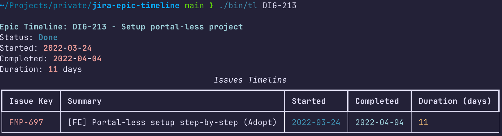

# JIRA Epic Timeline

A command-line tool that analyzes JIRA epics to determine their actual timeline based on the transitions of child issues.

## Overview

This tool connects to JIRA and for a given Epic key:
- Identifies all child issues
- Analyzes when each issue transitioned to "In Progress" and to "Done/Closed"
- Calculates the overall timeline for the entire Epic
- Displays a detailed summary with a table of all issues and their individual timelines

The timeline starts from the earliest date any issue was transitioned to "In Progress" and ends with the latest date any issue was transitioned to "Done" or "Closed". If there is no completion date, the Epic is considered to still be "In Progress".

## Installation

1. Clone this repository:
   ```
   git clone https://github.com/yourusername/jira-epic-timeline.git
   cd jira-epic-timeline
   ```

2. Set up a Python environment (requires Python 3.13+):
   ```
   uv venv .venv
   source .venv/bin/activate  # On Windows: .venv\Scripts\activate
   uv pip install -e .
   ```

## Configuration

Create a `.env` file in the project root with your JIRA credentials:

```
JIRA_URL = "https://your-instance.atlassian.net"
JIRA_USERNAME = "your-email@example.com"
JIRA_API_TOKEN = "your-api-token"
```

You can copy the `.env.sample` file as a template:
```
cp .env.sample .env
```

To obtain a JIRA API token:
1. Log in to https://id.atlassian.com/manage-profile/security/api-tokens
2. Click "Create API token"
3. Give it a name (e.g., "JIRA Epic Timeline")
4. Copy the token value to your `.env` file

## Usage

There are two ways to run the tool:

### Using the command-line tool

```bash
./bin/tl EPIC-123
```

Where `EPIC-123` is the key of the JIRA epic you want to analyze.

### Using Python directly

```bash
python -m timeline.main EPIC-123
# or
make run  # Uses the epic ID configured in the Makefile
```

## Output

The tool will display:
- Epic summary and status (In Progress or Done)
- Start and completion dates
- Total duration in days
- A table of all child issues with:
  - Issue key and summary
  - When each issue started and completed
  - Duration for each issue (with * indicating ongoing issues)



## Development

### Requirements
- Python 3.13+
- Dependencies as listed in `pyproject.toml`

### Linting

Run linting checks with:
```
make lint
```

This will run Ruff to check and format your code.

### Project Structure

- `src/timeline/`: Main package with all the functionality
  - `timeline.py`: Core functions for JIRA interactions and timeline calculations
- `bin/`: Command-line scripts
  - `tl`: Bash script wrapper for the Python tool
  - `tl.py`: Python entry point
